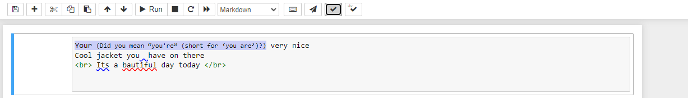

# Jupyter Classic -grammarchecker

A Jupyter extension for grammar and spell checking. Created for McMaster's COMPSCI 4TB3 - Syntax Tools and Compilers final project.
Originally developed by [Ritesh](https://github.com/RiteshPatel00), [Sunny](https://github.com/snuuy) and [Tahseen (me)](https://github.com/ahmedt26).
This is a copy of the original project, ported to GitHub so future employers or anyone interested can view source code.



The Jupyter extension uses LanguageTool's open source grammar checker to check for grammatical errors within Markdown cells in Jupyter Notebook. Error messages appear as the user hovers over the correction.

LanguageTool does not take Markdown as input, so the Markdown is first converted to <i>AnnotatedText</i>, which LanguageTool can understand. To do so we use the open-source library [`annotatedtext-remark`](https://github.com/prosegrinder/annotatedtext-remark), which makes use of the popular `remark` markdown processor. 


## Installation

### Markdown Parser Node Server
-----------------------------------
##### Requirements
To run the markdown parser server, execute the following commands  in the `server\markdown_parser` directory. The server will listen on port 3000 by default. 

```CMD
npm install
```

```CMD
node server.js
```
### Grammar Checker Flask Server
-----------------------------------
##### Requirements
To run the LanguageTool server, execute the following commands in the `server\grammar_checker` directory. The server will listen on port 5000 by default. 
```CMD
pip install -r requirements.txt
```
```CMD
set FLASK_APP=app
flask run
```

<b>Note:</b> This is Python wrapper around a Java LanguageTool server, so your system must have JRE installed.
### Jupyter Extension
-----------------------------------
##### Requirements
For Jupyter Notebook, you will need the latest version of Jupyter for the extension to behave correctly:

```CMD
pip install -U jupyter
```

Before continuing, make sure to [enable the installation of Jupyter Notebook extensions](https://tljh.jupyter.org/en/latest/howto/admin/enable-extensions.html).

To install the grammar checker extension, in the `root` directory, run:

```CMD
jupyter nbextension install grammar_checker
```
```CMD
jupyter nbextension enable grammar_checker/main
```
There should now be an option to enable the jupyter extension under the `nbextensions` tab.


## Usage

Once the extension is enabled, you can toggle it on/off with the  button  on the menu bar. 

If the extension is toggled on, grammar and spell checking will be activated for all markdown and text cells in the notebook. It will continously check and underline errors as you update the contents of the cell. A blue underline is a grammar error, and a red underline is a spelling error. To see the error message, hover your mouse pointer over the underlined text. 


